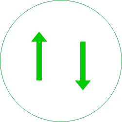

<div align="center">
    
    <h3 align="center">Requests4j</h3>
    <i>An elegant & performant Http client for Java</i>
</div>

-----------

## 1. Overview

`Requests4j` is an elegant abstraction on top of 2 performant libraries, including:

- [async-http-client](https://github.com/AsyncHttpClient/async-http-client): Asynchronous Http and WebSocket Client library for Java

- [dsl-json](https://github.com/ngs-doo/dsl-json): High performance JVM JSON library

## 2. Installation

Before using `Requests4j`, you must declare it as a dependency of your Maven project. For example:

```xml
<dependency>
    <groupId>com.bigsonata.requests</groupId>
    <artifactId>requests4j</artifactId>
    <version>0.1.0</version>
</dependency>
```

You also have to add following dependencies:

```xml
<dependency>
    <groupId>org.asynchttpclient</groupId>
    <artifactId>async-http-client</artifactId>
    <version>2.4.7</version>
</dependency>

<dependency>
    <groupId>junit</groupId>
    <artifactId>junit</artifactId>
    <version>4.11</version>
    <scope>test</scope>
</dependency>

<dependency>
    <groupId>ch.qos.logback</groupId>
    <artifactId>logback-classic</artifactId>
    <version>1.2.3</version>
</dependency>

<dependency>
    <groupId>ch.qos.logback</groupId>
    <artifactId>logback-core</artifactId>
    <version>1.2.3</version>
</dependency>

<dependency>
    <groupId>org.apache.commons</groupId>
    <artifactId>commons-lang3</artifactId>
    <version>3.7</version>
</dependency>

<dependency>
    <groupId>com.dslplatform</groupId>
    <artifactId>dsl-json-java8</artifactId>
    <version>1.8.0</version>
</dependency>

<dependency>
    <groupId>com.google.guava</groupId>
    <artifactId>guava</artifactId>
    <version>26.0-jre</version>
</dependency>
```

`NOTE`: Java 8 (or higher) is required.

## 3. Build

```sh
$ mvn package
```

## 4. Usages

More advanced usages are found in [src/test](src/test/)

### 4.1 Making requests

First you have to craft an instance of `Requests`:

```java
Requests requests = Requests.newBuilder()
    .build(AsyncRequests.class);
```

Then invoke `get`, `post`, `put`, `delete`

```java
requests
    .get("https://github.com")
    .exec() // returns a CompletableFuture
    .thenAccept(
        response -> {
            System.out.printf(
                "request.id=%s\trequest.timestamp=%s\tresponse.latency=%s\n",
                response.request.id, response.request.timeStamp, response.latency);
        })
    .join();
```

### 4.2 Working with Json

`Requests4j` is deeply integrated with `dsl-json`:

```java
@CompiledJson
static class Point {
    public int x = 0;
    public int y = 0;

    public Point(int x, int y) {
        this.x = x;
        this.y = y;
    }
}

Point point = new Point(3, 5);

DslJsonCodec jsonCodec = new DslJsonCodec(Point.class);
Requests requests = Requests.newBuilder()
    .setJsonCodec(jsonCodec)
    .build(AsyncRequests.class);

// From now on, you're ready to serialize objects
String json = requests.toJson(point);
// or deserialize them
Point point1 = requests.toObject(Point.class, json);

// What's about sending an Ajax request?
HttpResponse response = requests.post(API)
    .bodyJson(point)
    .exec()
    .get();

// You can deserialize response as a Point instance also
Point point2 = response.asObject(Point.class);
```

## 5. How to Contribute

1. Check for [open issues](https://github.com/anhldbk/requests4j/issues) or open a fresh issue to start a discussion around a feature idea or a bug. 

2. Fork the repository on GitHub to start making your changes to the master branch (or branch off of it).

3. Write a test which shows that the bug was fixed or that the feature works as expected.

4. Send a pull request and bug the maintainer until it gets merged and published. :) Make sure to add yourself to [AUTHORS](AUTHORS.md).